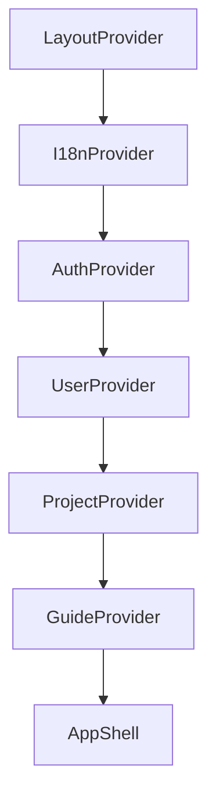

# Technical Documentation Frontend

## Overview
The frontend of **Jenga** is responsible for all user-facing workflows such as project selection, ticket editing, sprint planning, authentication, and internationalization.

It is implemented as a **SolidJS single-page application (SPA)** and communicates with the backend through a generated OpenAPI client.

## Core Technologies
These are the main dependencies used to build the frontend:

- **Programming Language:** [TypeScript](https://www.typescriptlang.org/)
- **Framework:** [SolidJS](https://www.solidjs.com/)
- **Build Tool:** [Vite](https://vitejs.dev/)
- **Component Library:** [SUID Material](https://suid.io/)
- **Routing:** [@solidjs/router](https://github.com/solidjs/solid-router)
- **Internationalization:** [i18next](https://www.i18next.com/)
- **PWA:** [vite-plugin-pwa](https://vite-pwa-org.netlify.app/)
- **API Client Generation:** [openapi-typescript-codegen](https://github.com/ferdikoomen/openapi-typescript-codegen)

## High-Level Architecture

### Route Structure
The route tree is defined in `frontend/jenga/src/index.tsx` and mounted below `App`:

- `/` -> `Home`
- `/Profile` -> `Profile`
- `/Sprint` -> `Sprint`
- `/About` -> `About`
- `/Privacy` -> `Privacy`

### Provider Composition
The provider stack is composed in `frontend/jenga/src/App.tsx`.



Responsibilities:

- `LayoutProvider`: shared layout state (e.g. sidebar visibility)
- `I18nProvider`: translation loading and language switching
- `AuthProvider`: login/register/logout and OpenAPI token setup
- `UserProvider`: authenticated user data
- `ProjectProvider`: projects, tickets, ticket updates, labels, relation sync
- `GuideProvider`: in-app guided tours

### Data Flow Pattern
The frontend follows this pattern:

`UI event -> provider action -> API call -> provider state update -> reactive render`

This keeps async logic and server coordination in providers while components focus on rendering and interaction handling.

## Source Code Structure

```yaml title="Frontend source structure"
frontend/jenga/
  src/
    api/              # generated API client (do not edit manually)
    components/       # reusable UI building blocks
    pages/            # route-level pages
    provider/         # shared state + async domain actions
    locales/          # i18n translation files (en/de)
    utils/            # helper functions
    App.tsx           # app shell + provider composition
    index.tsx         # router setup + app bootstrap
  public/             # static assets (including PWA icons)
  openapi.yaml        # OpenAPI spec consumed by gen:api
  vite.config.ts      # build, dev server, PWA configuration
```

## API Integration
The frontend API client is generated from `frontend/jenga/openapi.yaml`.

Important rules:

- Do not manually edit `frontend/jenga/src/api`.
- Update `openapi.yaml` from the backend contract first.
- Regenerate the client using `npm --prefix frontend/jenga run gen:api`.

## Build Dependency on Backend
Frontend build and API generation depend on the backend contract:

1. Build/start backend and ensure OpenAPI schema is up to date.
2. Update `frontend/jenga/openapi.yaml` from backend output.
3. Run `gen:api` to regenerate typed frontend client code.
4. Run frontend build (`npm --prefix frontend/jenga run build`).

Detailed command sequence is documented in [Installation -> Build Frontend](../installation/BuildFrontend.md).

## Internationalization
Translations are loaded via `I18nProvider` from:

- `frontend/jenga/src/locales/en.json`
- `frontend/jenga/src/locales/de.json`

Whenever a user-visible text changes, both locale files should be updated in the same change.

## PWA Setup
PWA support is configured in `frontend/jenga/vite.config.ts` using `vite-plugin-pwa`.

Current setup includes:

- generated service worker (`generateSW` default)
- manifest configuration (`name`, `short_name`, theme color)
- icons from `frontend/jenga/public/icons/`
- development mode support for local testing

## Current Limitations
- No dedicated offline fallback route/page yet.
- No explicit runtime caching strategy for API data.
- No custom app update UX (e.g. update toast/prompt) implemented yet.
