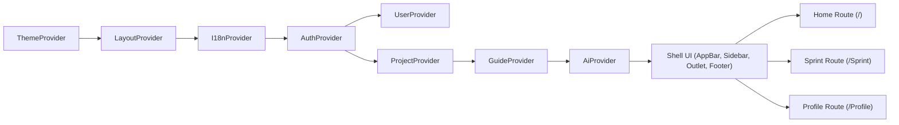
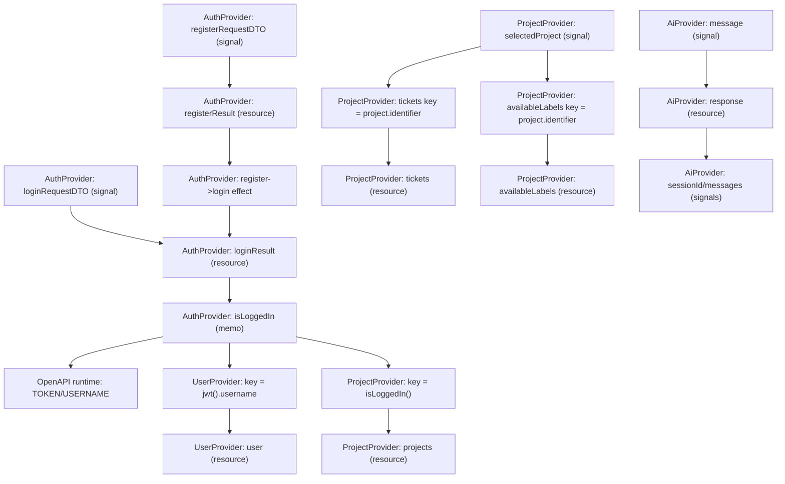
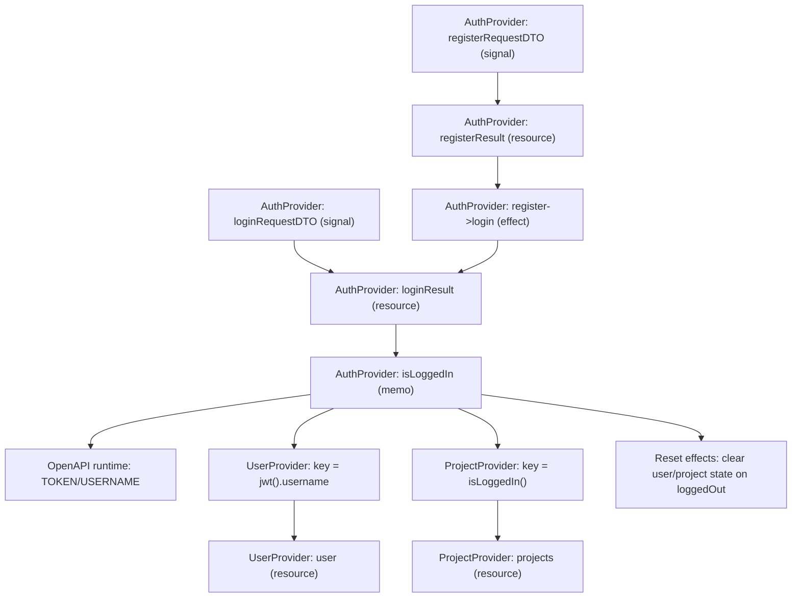
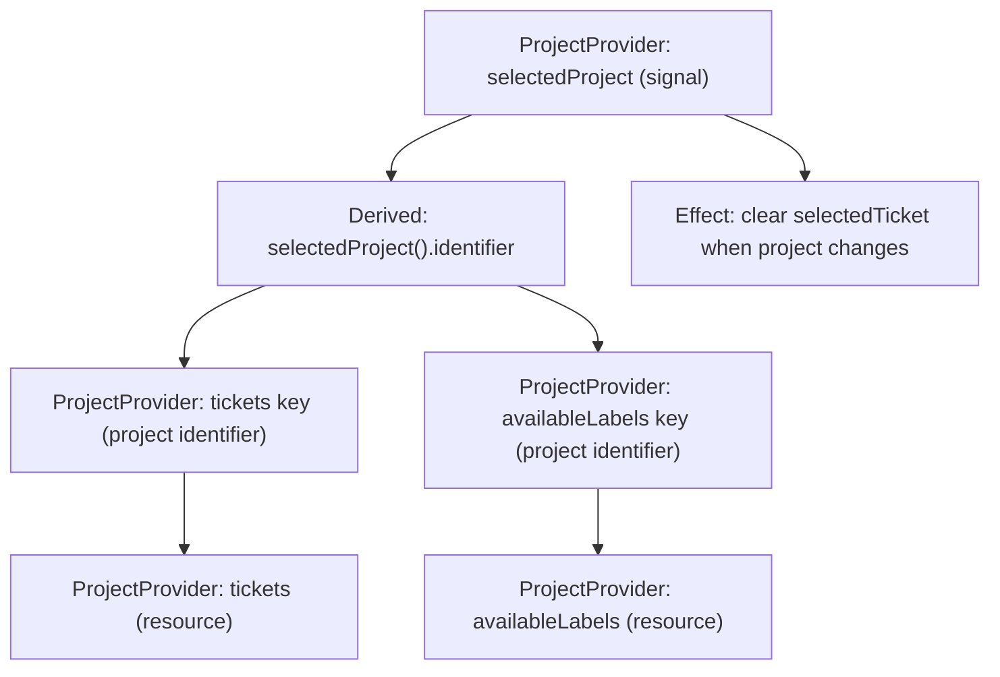
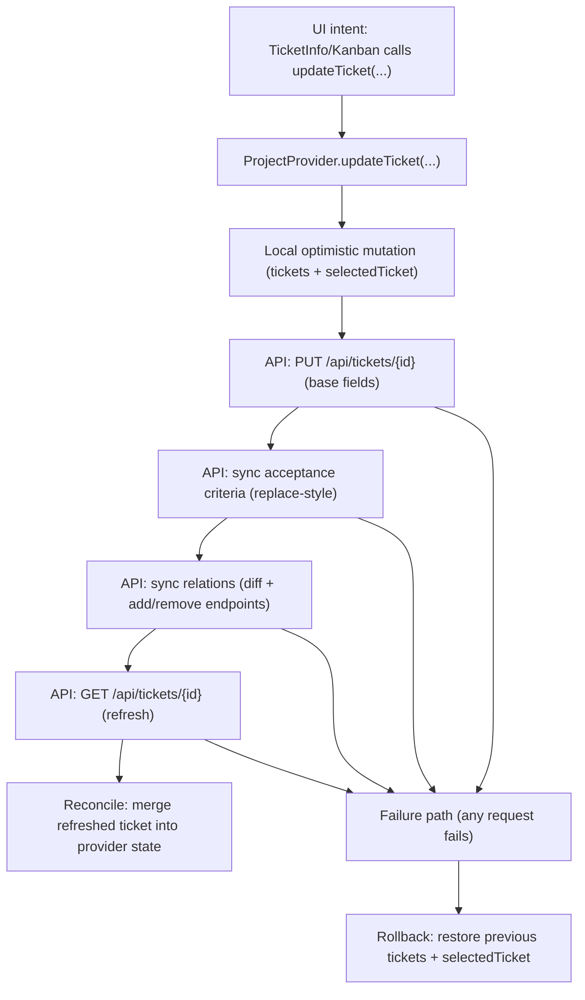
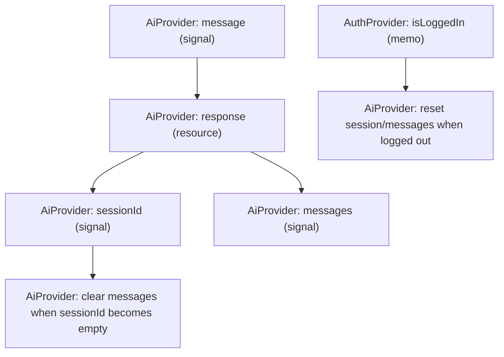
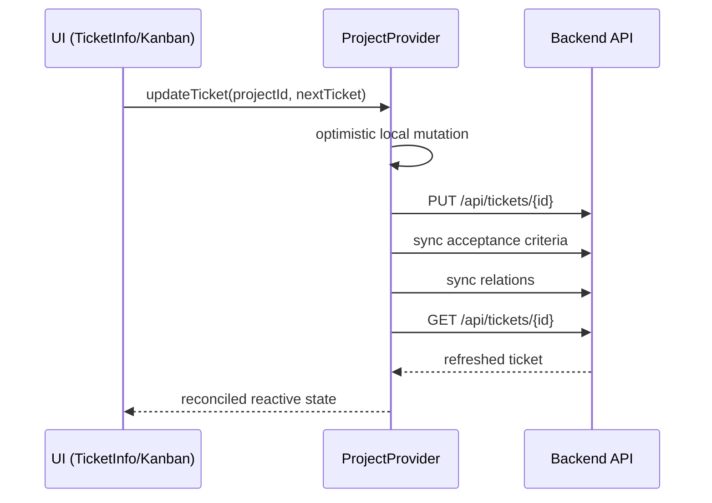

# Frontend State and Data Flow

## Overview
This document describes how state is represented, how Solid reactivity drives updates, and how data flows through providers and UI components at runtime.

## State Model
State is represented through Solid reactive primitives with provider-scoped ownership.

| Layer | Owner | Typical state |
|---|---|---|
| UI-global | `LayoutProvider` | sidebar visibility |
| Authentication | `AuthProvider` | login result, JWT token, session status |
| User domain | `UserProvider` | current user resource |
| Project domain | `ProjectProvider` | projects, tickets, selected project/ticket |
| Local component | page/component signals | dialogs, form feedback, transient inputs |

## Reactivity Model (Solid)
The runtime behavior is built from four reactive primitives:

- **`createSignal`**: mutable local state source used for UI events and provider-owned state values.
- **`createMemo`**: derived state that recalculates only when dependent signals/resources change.
- **`createResource`**: async reactive data source tied to a key function (for example project id or login state).
- **`createEffect`**: side-effect hook that reacts to dependency changes (for cleanup, synchronization, or state reset).

Providers compose these primitives to expose stable read/write interfaces to components.

## Framework: SolidJS (Reactivity)
SolidJS is a reactive UI framework that uses fine-grained dependency tracking. Instead of rerendering whole component trees, Solid tracks dependencies at the level of individual signal/resource reads and updates only the computations and DOM nodes that depend on the changed value.

In this frontend, SolidJS is used primarily for:
- provider-owned state and derived values (signals and memos)
- reactive async data loading (resources keyed by auth state or project selection)
- effectful cleanup and synchronization on state transitions (effects)

### Dependency Tracking and Updates
Solid tracks dependencies at the level of individual reads.

Observed consequence in this frontend:
- when a component reads `signal()` or `resource()`, Solid subscribes that computation to updates from the owner
- when the owner updates the signal/resource, only dependent computations rerun and affected DOM nodes are patched

This makes provider state usable as a shared reactive source without global rerender cycles.

### Resources as Keyed Async Nodes
`createResource(keyFn, fetcher)` behaves like a reactive async node.

In the current providers, resources are typically keyed by either:
- authentication state (fetch only when logged in)
- selected project identifier (fetch tickets only when a project is active)

When the key becomes `undefined`/`null`, resources stop fetching and downstream UI naturally converges to empty/placeholder states.

In the current implementation this is the main domain-loading mechanism: resources are activated by auth state and project selection rather than being manually triggered from page components.

## Composition Graph (Provider Nesting)
The following graph describes **composition and availability**: which providers wrap which runtime layers. This is not a reactive dependency graph. It answers "what must be mounted for a feature to exist", not "what recomputes when a signal changes".

Observed behavior:
- when auth becomes invalid, user/project data is cleared
- ticket resources depend on selected project id
- page components subscribe to provider resources and rerender automatically

The edges above describe provider nesting and route availability. The runtime data flow is driven by reactive keys (for example `isLoggedIn()` and the selected project identifier) and by provider commands such as `updateTicket(...)`.

## Reactive Dependency Graph (Keys and Resources)
The next graph focuses on the **reactive triggers** used for domain loading and request execution. Arrows indicate "reads/keys drive recomputation or refetch".

### Interpretation (What Actually Triggers What)
This graph compresses several patterns that repeat across providers:

- **Signals trigger resources**: a `createSignal(...)` value is used as the key function of a `createResource(...)`. When the signal changes, the resource fetcher runs again.
- **Resources feed derived state**: memos such as `isLoggedIn()` read a resource and publish a stable boolean accessor for downstream logic.
- **Keys gate domain loading**: providers intentionally return `undefined`/`null` keys when a domain should not be active (for example when logged out). This prevents fetch execution and allows downstream UI to converge to empty state.

In practice, this means "data loading" is driven by a small number of key functions rather than by explicit `fetch()` calls from route components.

## Additional Reactivity Graphs (Detailed Views)
The graphs below restate the same implementation from different angles. They are intentionally redundant in structure but narrower in scope, so each can be read step-by-step.

### Authentication to Domain Loading (Auth, OpenAPI, Resources)
This graph focuses on how authentication becomes the activation gate for the user/project domain.

Notes:
- The OpenAPI runtime assignment is a side effect of evaluating `isLoggedIn()`; it is not a separate fetch.
- Domain resources are keyed so "logged out" naturally converges to inactive resources.

### Project Selection to Ticket/Label Loading
This graph isolates how project selection drives the active ticket domain.

Notes:
- Selecting a project does not call "fetch tickets" directly. It changes a key, which triggers the resource.
- Clearing `selectedTicket` on project changes prevents stale sidebar data from referencing the previous project.

### Ticket Mutation (Optimistic Update, Sync, Reconciliation)
This graph describes the write path that is shared by form submits and drag-and-drop.

Notes:
- The "failure path" is a provider concern: UI code does not need to manually restore domain state.
- The refresh step ensures backend-side normalization is reflected in the UI model.

### AI Chat Reactivity (Contextual Requests)
This graph captures the reactive nature of the chat integration. It is domain state driven, but uses a separate provider.

## Reactive Domain Loading
Domain loading is driven by a small set of reactive keys:

- `AuthProvider.isLoggedIn()` activates downstream resources and also publishes auth material into the OpenAPI runtime.
- `UserProvider` is keyed by the current username derived from the JWT.
- `ProjectProvider` loads the project list while logged in and refines ticket loading by selected project identifier.

This design makes most pages “subscription-based”: they read provider resources and call provider commands, but do not own fetch orchestration.

### Keyed Resources (Concrete Runtime Nodes)
The following table lists the major runtime resource nodes and the key that controls them.

| Provider | Resource | Key concept | Fetch effect |
|---|---|---|---|
| `AuthProvider` | `loginResult` | `loginRequestDTO` signal | POST login, publish JWT into `OpenAPI.TOKEN`/`OpenAPI.USERNAME` via memo |
| `AuthProvider` | `registerResult` | `registerRequestDTO` signal | POST registration, then effect assigns result into `loginResult` |
| `UserProvider` | `user` | `jwt().username` | GET user profile for current session user |
| `ProjectProvider` | `projects` | `isLoggedIn()` boolean gate | GET project list for current session |
| `ProjectProvider` | `tickets` | selected project identifier | GET all tickets for current project |
| `ProjectProvider` | `availableLabels` | selected project identifier | GET labels for current project |
| `AiProvider` | `response` | `message` signal | POST chat request with (user, project, ticket) context |

The important property is that a missing key does not throw. It represents “inactive domain”, so a resource naturally settles into `undefined` and the UI displays empty state or placeholders.

## Runtime Flows

### Authentication Flow
1. User submits credentials.
2. `AuthProvider` triggers login resource.
3. On success, token and username are assigned to OpenAPI runtime config.
4. `isLoggedIn` derivations activate downstream resources.
5. `UserProvider` and `ProjectProvider` begin fetching data.

On logout:
- login resource is reset
- OpenAPI token is removed implicitly via memo branch
- user/project resources are cleaned by dependent effects

### Session Cleanup (Logout Reset)
Logout is treated as a hard boundary for domain state:

- `AuthProvider` clears auth material, which immediately makes `isLoggedIn()` false.
- `UserProvider` and `ProjectProvider` observe the inactive session and clear their local state (projects, selected project, tickets, selected ticket).
- The UI reacts to the cleared resources and converges to an unauthenticated baseline without requiring explicit route-level cleanup.

### Project Selection Flow
1. User selects project in `Projects`.
2. `ProjectProvider.selectedProject` updates.
3. tickets resource key changes to project identifier.
4. tickets refetch for the selected project.

This avoids manual fetch calls in most view components.

### Ticket Update Flow (Critical Path)
`TicketInfo` and `Kanban` both route updates through `ProjectProvider.updateTicket`.

If any request fails:
- provider restores previous tickets and selected ticket
- caller receives error and can show message

#### Why Update Is Centralized
This update path exists to ensure:

- the same mutation semantics apply regardless of entry point (form submit, drag-and-drop, dialogs)
- optimistic UI state is reconciled with server truth after backend-side normalization
- relation synchronization is executed consistently (including bidirectional relation endpoints)

The cost is a more complex provider write path, but it avoids duplicated orchestration logic across multiple components.

### Kanban Drag-and-Drop Path
1. Drag source stores ticket id in `dataTransfer`.
2. Drop target resolves ticket from provider state.
3. Target computes new `(status, assignee)`.
4. Target calls `updateTicket` (same critical path as form submit).

Result: one write path for all ticket mutations.

### Filter Flow
`TicketFilters` owns a filter-row array and emits changes upward.

Important behavior:
- always keeps at least one empty row
- adds a trailing empty row when last row becomes active
- matching stays pure via `matchesTicketFilters`

This separation keeps filter UI logic independent from ticket data loading.

## Consistency Strategy
The app uses **optimistic write + server reconciliation**.

Why:
- immediate UI feedback
- final state correctness after backend-side normalization
- explicit rollback in error case

Tradeoff:
- provider write path is more complex, but avoids inconsistent duplicated mutation logic in multiple components.
