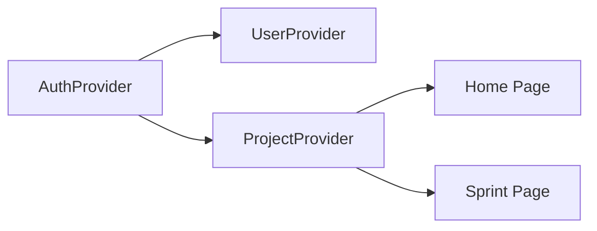
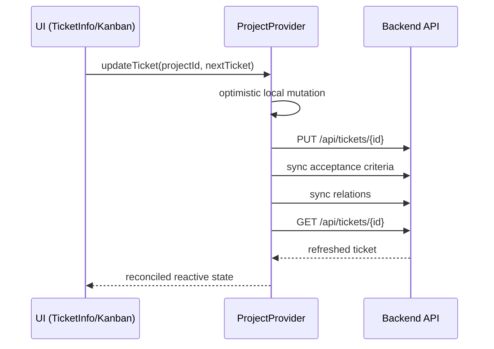

# Frontend State and Data Flow

## State Model
The frontend uses Solid's reactive primitives with provider-scoped ownership.

| Layer | Owner | Typical state |
|---|---|---|
| UI-global | `LayoutProvider` | sidebar visibility |
| Authentication | `AuthProvider` | login result, JWT token, session status |
| User domain | `UserProvider` | current user resource |
| Project domain | `ProjectProvider` | projects, tickets, selected project/ticket |
| Local component | page/component signals | dialogs, form feedback, transient inputs |

## Reactive Dependency Graph

Key behavior:
- when auth becomes invalid, user/project data is cleared
- ticket resources depend on selected project id
- page components subscribe to provider resources and rerender automatically

## Authentication Flow
1. User submits credentials.
2. `AuthProvider` triggers login resource.
3. On success, token and username are assigned to OpenAPI runtime config.
4. `isLoggedIn` derivations activate downstream resources.
5. `UserProvider` and `ProjectProvider` begin fetching data.

On logout:
- login resource is reset
- OpenAPI token is removed implicitly via memo branch
- user/project resources are cleaned by dependent effects

## Project Selection Flow
1. User selects project in `Projects`.
2. `ProjectProvider.selectedProject` updates.
3. tickets resource key changes to project identifier.
4. tickets refetch for the selected project.

This avoids manual fetch calls in most view components.

## Ticket Update Flow (Critical Path)
`TicketInfo` and `Kanban` both route updates through `ProjectProvider.updateTicket`.

If any request fails:
- provider restores previous tickets and selected ticket
- caller receives error and can show message

## Kanban Drag-and-Drop Path
1. drag source stores ticket id in `dataTransfer`
2. drop target resolves ticket from provider state
3. target computes new `(status, assignee)`
4. calls `updateTicket` (same critical path as form submit)

Result: one write path for all ticket mutations.

## Filter Flow
`TicketFilters` owns a filter-row array and emits changes upward.

Important behavior:
- always keeps at least one empty row
- adds a trailing empty row when last row becomes active
- matching stays pure via `matchesTicketFilters`

This separation keeps filter UI logic independent from ticket data loading.

## Consistency Strategy
The app uses **optimistic write + server reconciliation**.

Why:
- immediate UI feedback
- final state correctness after backend-side normalization
- explicit rollback in error case

Tradeoff:
- provider write path is more complex, but avoids inconsistent duplicated mutation logic in multiple components.
