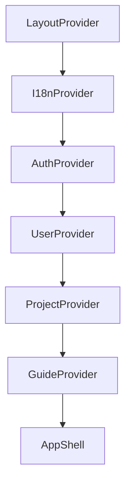

# Frontend System Design

## Runtime Building Blocks
The runtime is split into four layers:

1. **Bootstrap layer** (`index.tsx`)
2. **Shell layer** (`App.tsx`)
3. **State layer** (`provider/*`)
4. **Feature layer** (`pages/*` + `components/*`)

This separation limits cross-cutting complexity.

## Bootstrap Layer
The entrypoint does three critical tasks:

1. initializes router and route tree
2. configures API base URL (`OpenAPI.BASE = window.location.origin`)
3. mounts app into DOM root

The API base is intentionally derived from browser origin so frontend and backend can be deployed behind one host/proxy without rebuilding the app per environment.

## Shell Layer (`App.tsx`)
The shell owns global chrome:

- app bar
- sidebar
- page outlet
- footer

It also contains route-driven UI behavior. Example: on `/` the sidebar is force-opened via effect.

## Provider Order and Why It Matters
Current order:

Design rationale:

- `LayoutProvider` must be outermost so shell controls are globally available.
- `I18nProvider` wraps guide and UI to ensure translated labels exist before rendering.
- `AuthProvider` must be initialized before user/project data loading.
- `UserProvider` and `ProjectProvider` consume auth state.
- `GuideProvider` is placed after i18n/layout so steps can navigate routes and target translated, mounted UI.

## Module Boundaries
Use these boundaries to prevent logic duplication:

- `pages/*`: route composition and screen-level feedback
- `components/*`: local interactions and rendering
- `provider/*`: async orchestration, state mutations, server sync logic
- `api/*`: generated transport and DTO types only

## Route Responsibility Map
- `/`: project selection and import entry (`Projects`, `Filedrop`)
- `/Sprint`: ticket operation workspace (`TicketFilters`, `Kanban`, `Backlog`, `TicketInfo`)
- `/Profile`: current user data
- `/About`, `/Privacy`: static content

## Why This Structure Scales
- New pages can reuse provider actions without reimplementing API flow.
- Global policies (auth checks, rollback behavior, relation sync) remain centralized.
- UI refactors stay local because state and transport contracts are decoupled.
