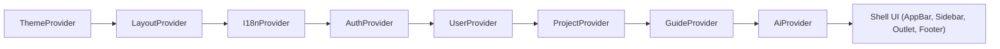

# Frontend System Design

## Runtime Building Blocks
The runtime is split into four layers:

1. **Bootstrap layer** (`index.tsx`)
2. **Shell layer** (`App.tsx`)
3. **State layer** (`provider/*`)
4. **Feature layer** (`pages/*` + `components/*`)

This separation limits cross-cutting complexity.

## Bootstrap Layer
The entrypoint does three critical tasks:

1. initializes router and route tree
2. configures API base URL (`OpenAPI.BASE = window.location.origin`)
3. mounts app into DOM root

The API base is intentionally derived from browser origin so frontend and backend can be deployed behind one host/proxy without rebuilding the app per environment.

## Shell Layer (`App.tsx`)
The shell owns global chrome:

- app bar
- sidebar
- page outlet
- footer

It also contains route-driven UI behavior. Example: on `/` the sidebar is force-opened via effect.

## Provider Order and Why It Matters
Current runtime context stack (outer -> inner):



Rationale:

- `ThemeProvider` (SUID Material) is outermost so UI components share one theme configuration.
- `LayoutProvider` is early so shell controls (sidebar open/closed) are globally available to the shell and the guided tour.
- `I18nProvider` wraps UI and the tour so translated labels exist before a tour step is constructed or rendered.
- `AuthProvider` owns the action-based auth/session lifecycle and writes token/username into the OpenAPI runtime configuration.
- Auth session publication follows a strict ordering invariant: OpenAPI credentials are written before auth state is published to reactive consumers.
- `UserProvider` and `ProjectProvider` consume auth state to load domain data only for an active session.
- `GuideProvider` depends on layout and i18n to navigate routes and target mounted, translated UI anchors reliably.
- `AiProvider` depends on auth/user/project state to include current context (user, project, selected ticket) in chat requests.

## Module Boundaries
These boundaries prevent logic duplication:

- `pages/*`: route composition and screen-level feedback
- `components/*`: local interactions and rendering
- `provider/*`: async orchestration, state mutations, server sync logic
- `api/*`: generated transport and DTO types only

## Source Code Structure
The runtime layers are reflected in the current source structure:

```yaml title="Structure of frontend source code"
frontend/jenga
└── src
    ├── api # generated OpenAPI client (DTOs + transport)
    ├── assets # images and static imports referenced by components
    ├── components # reusable UI widgets and local interactions
    ├── locales # i18n resources (en/de)
    ├── pages # route-level composition (Home/Sprint/Profile/...)
    └── provider # application state, side effects, server synchronization
```

This structure is not only organizational. It encodes an ownership rule: view code reads provider state and invokes provider commands, while providers own API interaction and reconciliation logic.

## Route Responsibility Map
- `/`: project selection and import entry (`Projects`, `Filedrop`)
- `/Sprint`: ticket operation workspace (`TicketFilters`, `Kanban`, `Backlog`, `TicketInfo`)
- `/Profile`: current user data
- `/About`, `/Privacy`: static content

## Why This Structure Scales
- New pages can reuse provider actions without reimplementing API flow.
- Global policies (auth checks, rollback behavior, relation sync) remain centralized.
- UI refactors stay local because state and transport contracts are decoupled.

## Frameworks and Libraries
The system design described above is implemented using the following key frontend technologies:

- SolidJS: reactive UI framework and component model used throughout `src/*`.
- @solidjs/router: client-side routing used in `src/index.tsx`.
- Vite: build tool and dev server, including the local `/api` proxy.
- SUID Material: component library used for UI composition in `src/components/*` and `src/pages/*`.

The guided tour and localization stack are documented separately:
- [Guided Tour](guided_tour.md) (Shepherd.js)
- [Internationalization (i18n)](i18n.md) (i18next)
